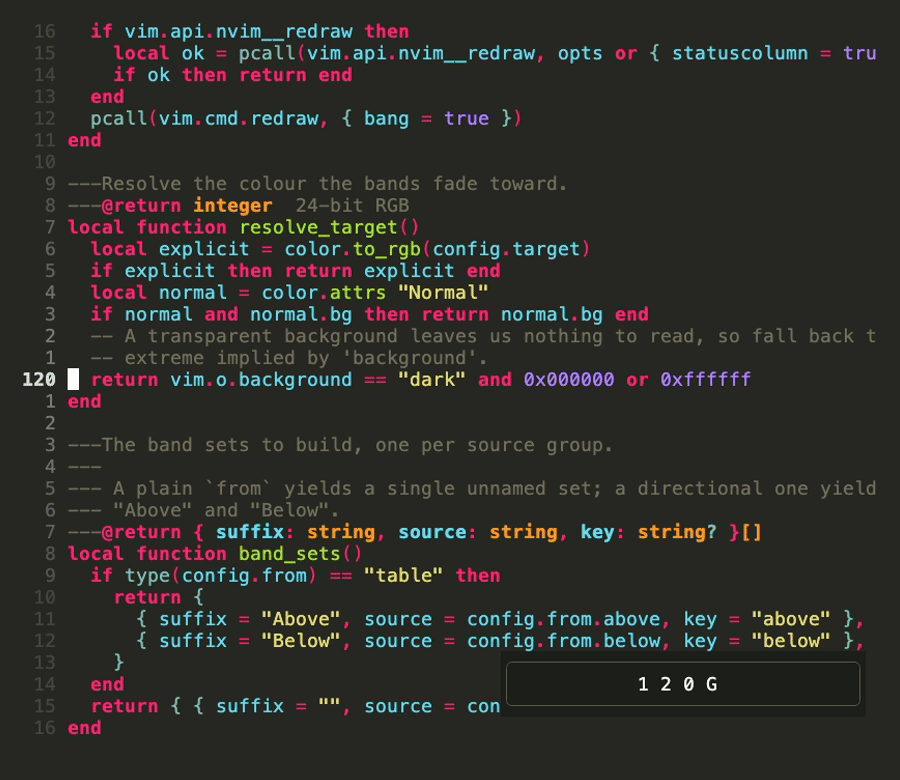
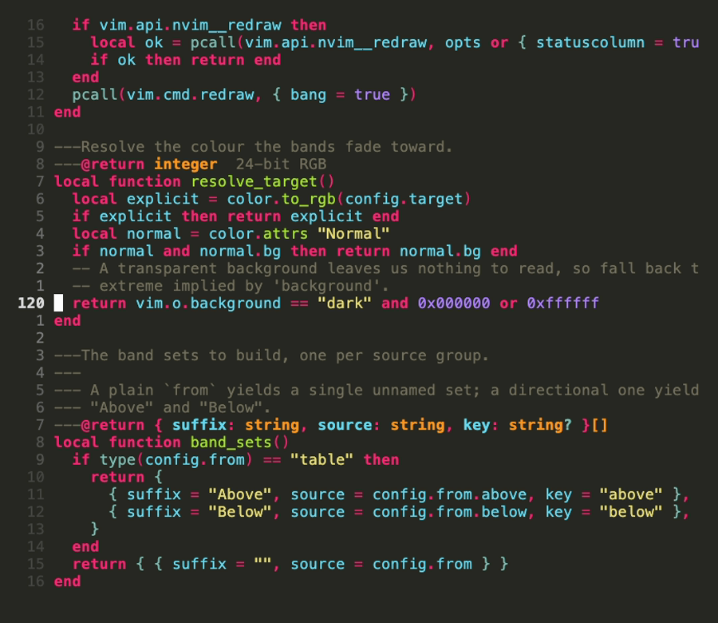
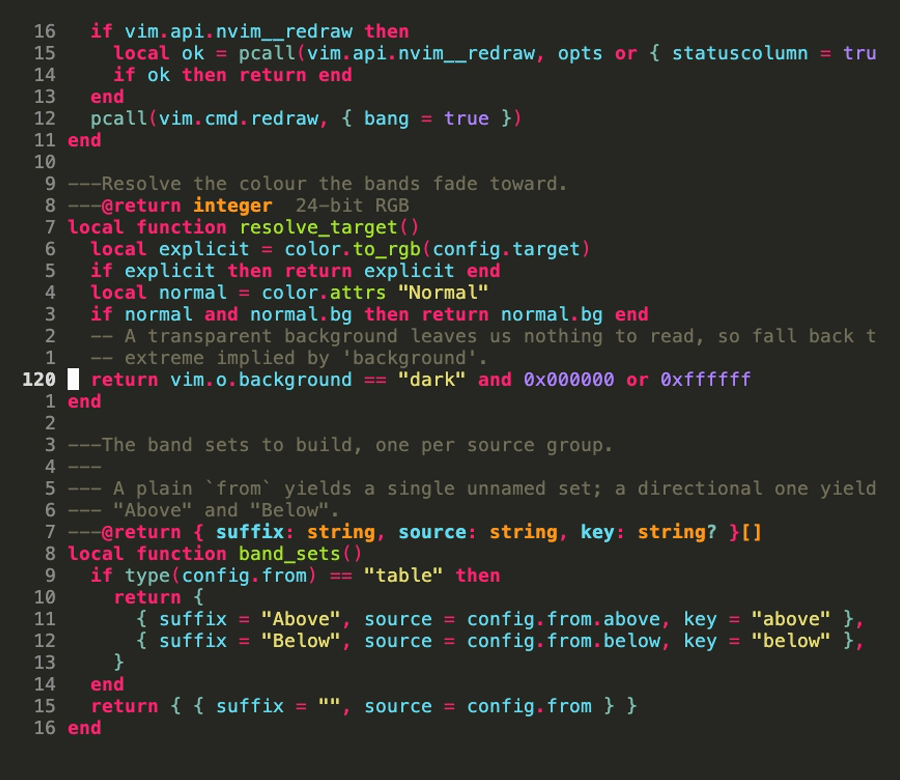
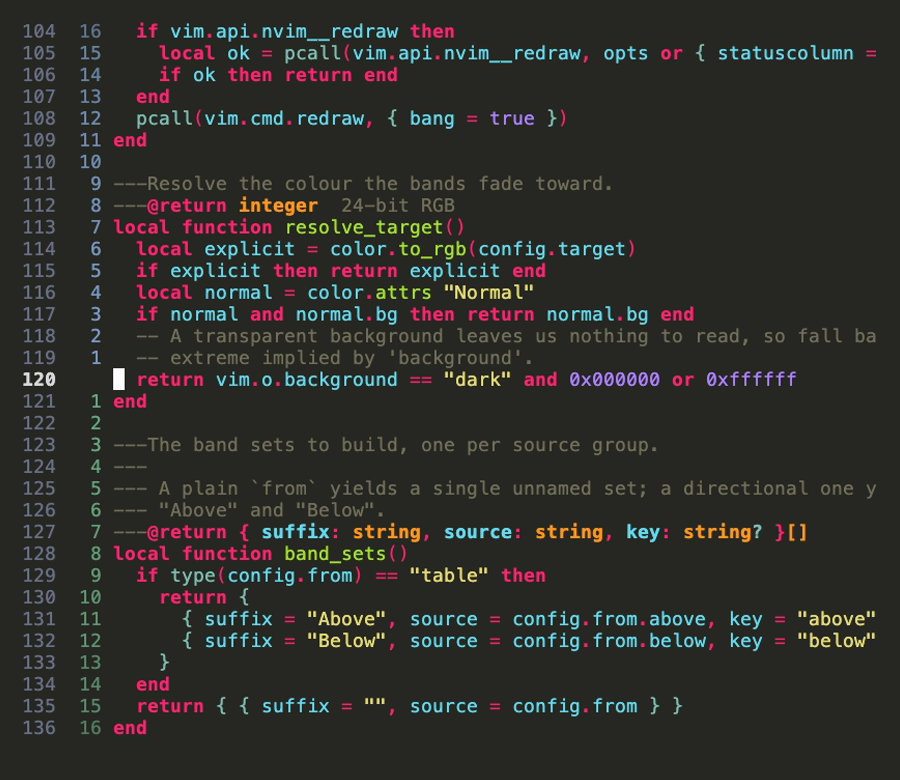

# bokeh.nvim

Depth of field for your line numbers.

Line numbers far from the cursor are blended toward the background in discrete
steps, so the ones you are about to jump to stay legible and the rest recedes.



That is all it does. Signs, folds and the layout of the number column stay with
whoever owns your `'statuscolumn'`.

The same buffer at the same cursor position, with the fade on and off:

| `:Bokeh on` | `:Bokeh off` |
|---|---|
|  |  |

[日本語版の README](README.ja.md)

## Requirements

- Neovim 0.10+
- `'termguicolors'` (the fade is computed as 24-bit colour)
- Optionally [statuscol.nvim](https://github.com/luukvbaal/statuscol.nvim)

## Installation

With [lazy.nvim](https://github.com/folke/lazy.nvim):

```lua
{ "delphinus/bokeh.nvim", opts = {} }
```

## Usage

There are three ways in, in order of how much bokeh.nvim takes over.

### 1. Colour a line number renderer you already have

`require("bokeh").hl` returns nothing but a `%#BokehFadeN#` highlight item.
Put it in front of a segment that renders line numbers and keep that renderer's
behaviour — statuscol.nvim's thousands separator, `relculright`, sign-in-number
column and so on all keep working.

```lua
local bokeh = require "bokeh"
bokeh.setup()

local builtin = require "statuscol.builtin"
require("statuscol").setup {
  relculright = true,
  segments = {
    { text = { builtin.foldfunc }, click = "v:lua.ScFa" },
    { text = { bokeh.hl, builtin.lnumfunc }, click = "v:lua.ScLa" },
  },
}
```

### 2. Let bokeh.nvim render the numbers

`require("bokeh").segment` is a drop-in statuscol.nvim `text` segment. It
matches the built-in number column cell for cell: `'numberwidth'` counts the
separating space, so the number is right-aligned in one column less than that,
and with `'relativenumber'` set the cursor line's absolute number goes to the
left. Use `hl` in front of another renderer if you want a different layout —
statuscol.nvim's `relculright` or its `thousands` separator, say.

```lua
segments = {
  { text = { builtin.foldfunc }, click = "v:lua.ScFa" },
  { text = { require("bokeh").segment }, click = "v:lua.ScLa" },
}
```

### 3. Standalone

No other plugin involved: bokeh.nvim sets `'statuscolumn'` to the fold column,
the sign column and a faded number column.

```lua
require("bokeh").setup { standalone = true }
```

## Configuration

Defaults:

```lua
require("bokeh").setup {
  bands = 5,          -- number of fade steps
  distance = 12,      -- distance at which the deepest band starts
  amount = 0.7,       -- how far the deepest band is blended, 0..1
  curve = "linear",   -- "linear" | "ease_in" | "ease_out" | fun(t: number): number
  target = nil,       -- colour to fade toward; nil means the `Normal` background
  from = "LineNr",    -- highlight group the fade starts from, or { above = …, below = … }
  standalone = false, -- set 'statuscolumn' ourselves
  enabled = true,     -- start enabled
  redraw = "auto",    -- keep the fade in sync without 'relativenumber'
}
```

A deeper, shorter fade:

```lua
require("bokeh").setup { bands = 8, distance = 6, amount = 0.85, curve = "ease_in" }
```

`curve` shapes how the steps are distributed. `ease_in` keeps lines near the
cursor crisp and drops off late; `ease_out` fades hard right next to the cursor.
Pass your own `fun(t: number): number` if neither fits — `t` runs 0..1 across the
bands and the result scales `amount`.

### A different hue above and below

`v:relnum` is a distance and says nothing about direction, so by default lines
above and below the cursor fade alike. Name a group per direction to split them:

```lua
require("bokeh").setup {
  from = { above = "LineNrAbove", below = "LineNrBelow" },
}
```

That builds `BokehFadeAbove1` … and `BokehFadeBelow1` … instead of the plain
`BokehFadeN`, and the fade starts from each direction's own colour. Reading the
cursor line costs about 57ns per drawn line, so a full screen pays around 3µs.

## Building your own column

`hl` is the whole integration surface, so any column you can write in
`'statuscolumn'` can carry the fade. Absolute and relative side by side, with
the fade split by direction:



```lua
local bokeh = require "bokeh"

vim.api.nvim_set_hl(0, "GutterAbove", { fg = "#7b9ac7" })
vim.api.nvim_set_hl(0, "GutterBelow", { fg = "#6aa781" })
vim.api.nvim_set_hl(0, "GutterAbsolute", { fg = "#6b7089" })

bokeh.setup { from = { above = "GutterAbove", below = "GutterBelow" } }

function _G.Gutter()
  local width = #tostring(vim.api.nvim_buf_line_count(0))
  if vim.v.virtnum ~= 0 then return (" "):rep(width + 5) end

  local absolute = tostring(vim.v.lnum)
  absolute = (" "):rep(width - #absolute) .. absolute

  -- Blank rather than "0" on the cursor line.
  local relative = vim.v.relnum == 0 and "" or tostring(vim.v.relnum)
  relative = (" "):rep(4 - #relative) .. relative

  local absolute_hl = vim.v.relnum == 0 and "%#CursorLineNr#" or "%#GutterAbsolute#"
  return absolute_hl .. absolute .. bokeh.hl() .. relative .. " "
end

vim.o.statuscolumn = "%!v:lua.Gutter()"
```

None of that layout is bokeh's, and none of it needs to be: `hl()` returns an
empty string on the cursor line and while the fade is off, so the column keeps
its shape either way. The full file is [demo/example.lua](demo/example.lua).

## Turning it off

```vim
:Bokeh          " toggle
:Bokeh off
:Bokeh on
```

```lua
require("bokeh").disable()
require("bokeh").enable()
require("bokeh").toggle()   -- returns the state after flipping
require("bokeh").is_enabled()
```

Per scope, checked on every drawn line:

```lua
vim.g.bokeh_disable = true          -- everywhere
vim.b[buf].bokeh_disable = true     -- one buffer
vim.w[win].bokeh_disable = true     -- one window
```

In standalone mode, switching off restores the `'statuscolumn'` that was in
force before `setup()`. Otherwise the line numbers keep rendering, just with
`LineNr` instead of the fade bands — bokeh.nvim cannot unhook itself from
someone else's statuscolumn.

## Highlight groups

`BokehFade1` … `BokehFade{bands}`, where band 1 is nearest the cursor and
`bands` is the most faded. With a directional `from` they become
`BokehFadeAbove1` … and `BokehFadeBelow1` … instead. They are derived from
`from` (`LineNr` by default), keeping its other attributes, and are recomputed
on every `ColorScheme` so they track your colorscheme instead of freezing at
startup.

Override them after the fact if you want colours the blend cannot produce:

```lua
vim.api.nvim_create_autocmd("ColorScheme", {
  callback = function()
    vim.api.nvim_set_hl(0, "BokehFade5", { fg = "#2a2f45", italic = true })
  end,
})
```

The cursor line is never touched, so it keeps `CursorLineNr`.

## A note on `'relativenumber'`

`'statuscolumn'` is only re-evaluated on cursor movement when
`'relativenumber'` is set — see `:help 'statuscolumn'`. With only `'number'`
on, the fade would keep pointing at the line the cursor used to be on, so
bokeh.nvim forces the redraw itself in exactly that case. Set `redraw = false`
to opt out, or `redraw = true` to force it unconditionally.

`:checkhealth bokeh` reports this along with `'termguicolors'` and the state of
the fade bands.

## Non-goals

- Rendering absolute and relative numbers side by side. bokeh.nvim only
  colours — write the column yourself (see
  [Building your own column](#building-your-own-column)) or use
  [line-numbers.nvim](https://github.com/shrynx/line-numbers.nvim).
- Marks, folds, signs, wrapped-line indicators. All of those belong to the
  statuscolumn, not to the fade.

## License

MIT
